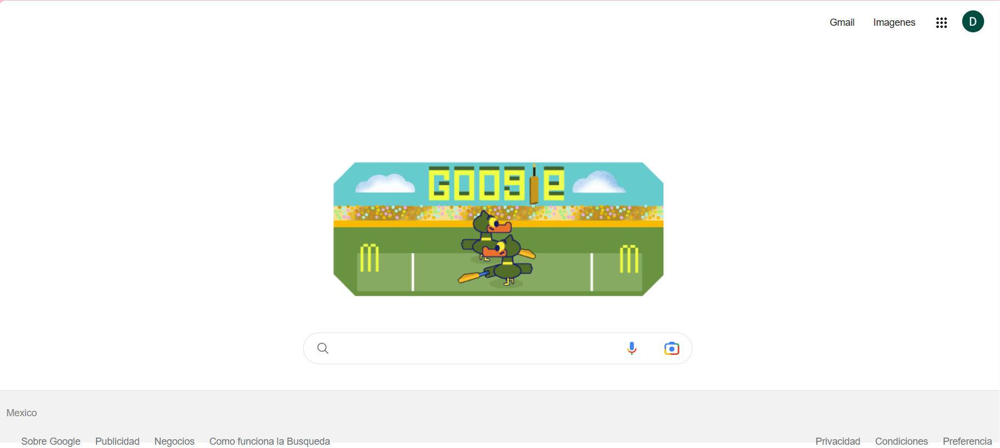

# Clon de google
Proyecto creado en **Tecnolochicas Pro** simulando la página principal del navegador de Google
************
Gracias a la ayuda del bootcamp pude realizar el clon del navegador de **google**
## Intro
El presente trabajo fue realizado con ayuda de **HTML y CSS**.Se trata de un navegador usado frecuentemente por las personas.
*Podras visitarlo en el siguiente enlace

**"Cada historia de éxito es una historia de constante adaptación, revisión y cambio". Richard Branson.**
## Contenido del proyecto 
1. Header
Sección muestra el menú y foto de perfil
2. Main
Contiene los elementos centrales de el buscador
3. Footer
Incluye hipervínculos al final de la página

Realizado por Daniela Pineda Jamaica 🫀💕
